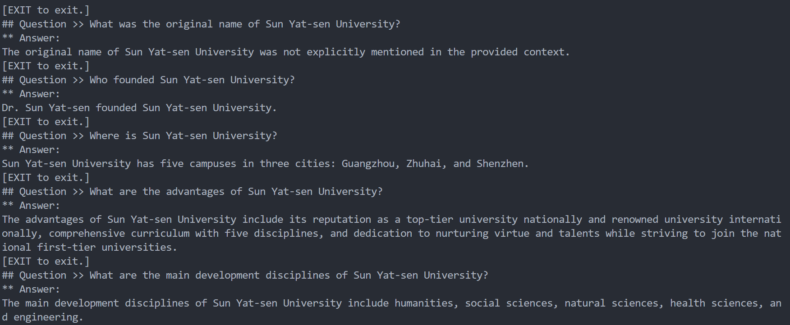

# 基于Llama3-8B的RAG问答系统

给定文档(此处为sysu_en.txt)，
使用Weaviate作为检索器，
使用llama3作为生成器。

构建了一个针对于给定文档的RAG问答系统。

## 环境
* python=3.8
* langchain_community
* weaviate-client
* Ollama & llama3-8B
* Linux系统

## 运行：
python main.py

## 参考结果
